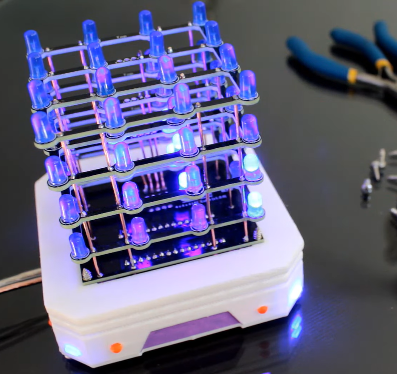
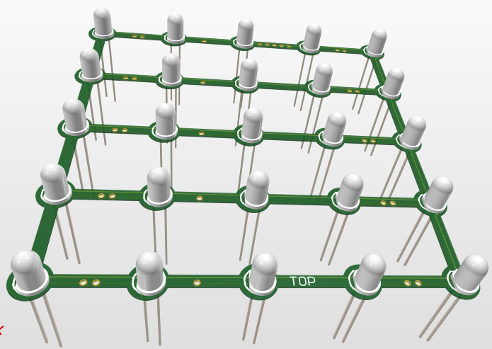
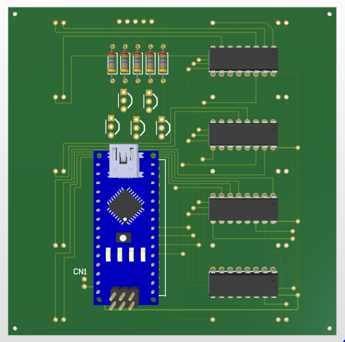
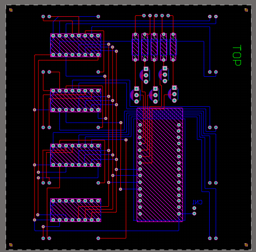
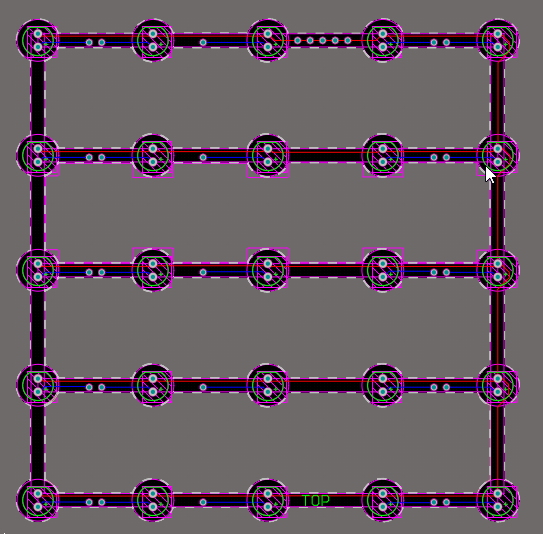

# 5x5x5 LED Cube using Arduino Nano & 74HC595

This project is a custom-designed **5x5x5 LED Cube** inspired by [this YouTube video](https://youtu.be/f7xFfsGhaso?si=Qx3wA84ntNaYWZto). It was upgraded from the original 4x4x4 version to support **125 LEDs** using Arduino Nano and **74HC595 shift registers** for GPIO expansion.

---

## 🔧 Features

- **5x5x5 Matrix** with 125 LEDs
- Controlled by **Arduino Nano**
- GPIO expanded using **3 chained 74HC595 shift registers**
- Efficient **multiplexing** for layer control
- Designed in **Altium Designer**
- **Transistor switching** for each layer
- Clean, manufacturable PCB layout

---

## 🧰 Hardware Used

| Component         | Quantity |
|------------------|----------|
| Arduino Nano      | 1        |
| 5mm LEDs          | 125      |
| 74HC595 Shift Register | 4        |
| NPN Transistors (e.g., 2N2222, BC547) | 5        |
| Resistors (for LEDs and base of transistors) | 5 |
| PCB (Custom designed) | 2        |
| Power Supply (5V) | 1        |

---

## 🧠 Design Logic

- **Anode Columns**: Driven by 74HC595s chained together to get 15 GPIO outputs.
- **Cathode Layers**: 5 layers controlled using NPN transistors.
- The cube is updated frame by frame with **persistence of vision** to create animations.

---

## 🚀 Getting Started

1. Upload Arduino code to Nano (coming soon).
2. Assemble the PCB and solder all components.
3. Power the board using 5V regulated supply.
4. Watch the cube light up in amazing animations.

---

## 🖼️ PCB Preview

Here are some snapshots of the final design:

  
   
    
     
 

---

## 📜 License

This project is open-source under the [MIT License](LICENSE).

---

## 📩 Credits

Special thanks to the inspiration from this video:  
[https://youtu.be/f7xFfsGhaso](https://youtu.be/f7xFfsGhaso)

---

